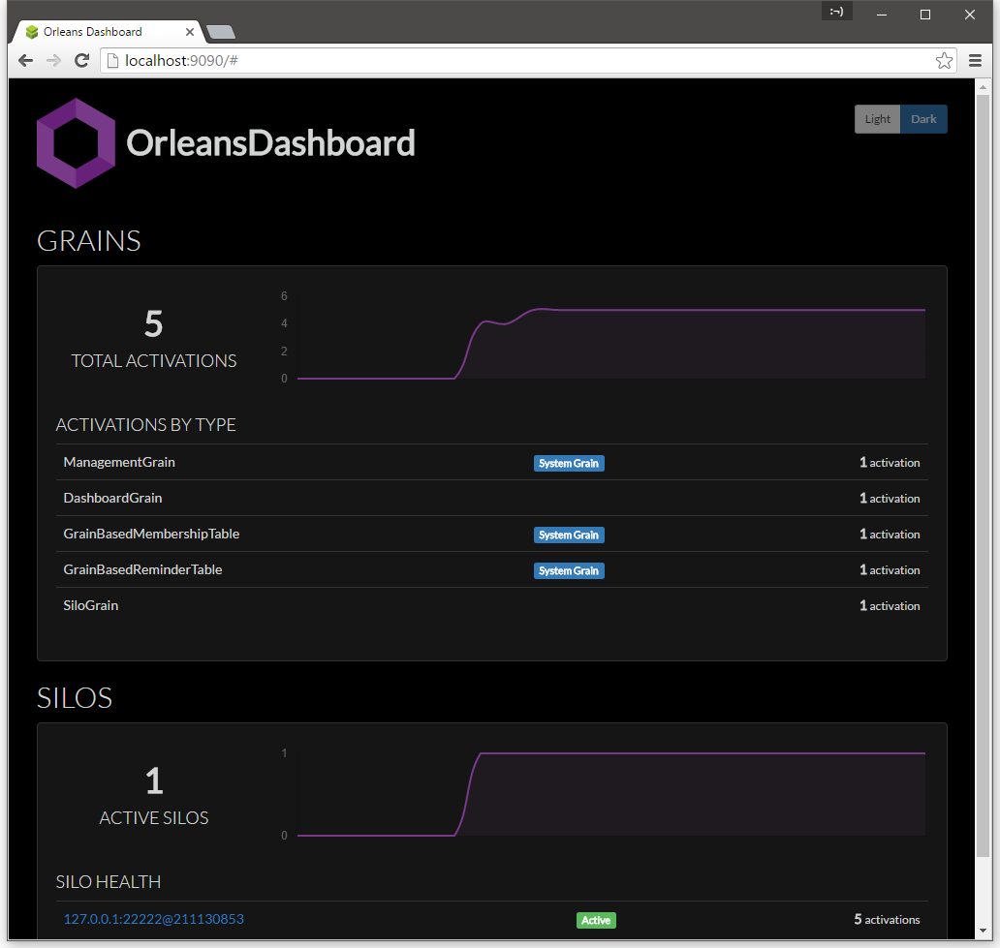
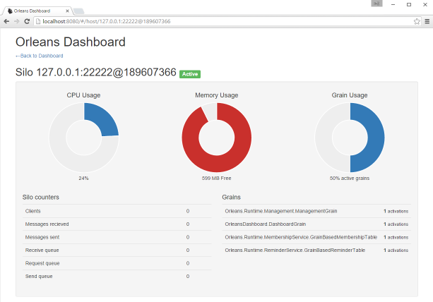

# Orleans Dashboard

[](https://ci.appveyor.com/project/richorama/orleansdashboard)

> This project is alpha quality, and is published to collect community feedback.

An admin dashboard for Microsoft Orleans.





## Installation

Using the Pacakge Manager Console:

```
PM> Install-Package OrleansDashboard
```

Then add this bootstrap provider to your Orleans silo configuration:

```xml
<?xml version="1.0" encoding="utf-8"?>
<OrleansConfiguration xmlns="urn:orleans">
  <Globals>
    <BootstrapProviders>
      <Provider Type="OrleansDashboard.Dashboard" Name="Dashboard" />
    </BootstrapProviders>
    ...
```

...or use programmatic configuration:

```c#
var siloHost = new SiloHost(...);
siloHost.InitializeOrleansSilo();
siloHost.Config.Globals.RegisterBootstrapProvider<Dashboard>("Dashboard");
siloHost.StartOrleansSilo();
```

Start the silo, and open this url in your browser: [`http://localhost:8080`](http://localhost:8080)

## Configuring the Dashboard

The dashboard supports the following attributes in the configuration:

* `Port` : Set the the number for the dashboard to listen on.
* `Username` : Set a username for accessing the dashboard (basic auth).
* `Password` : Set a password for accessing the dashboard (basic auth).

```xml
<BootstrapProviders>
    <Provider Type="OrleansDashboard.Dashboard" Name="Dashboard" Port="1234" Username="my_username" Password="my_password" />
</BootstrapProviders>
```

## Building the UI

The user interface is react.js, using browserify to compose the javascript delivered to the browser.
The HTML and JS files are embedded resources within the dashboard DLL.

To build the UI, you must have node.js installed, and browserify:

```
$ npm install browserify -g
```

To build the `index.min.js` file, follow these steps.

```
cd App
browserify -t babelify index.jsx --outfile ../OrleansDashboard/index.min.js
```

## Todo

* ~~Find a workaround to the Windows namespace reservations~~
* Consider additional data sources
* Consider allowing activation / garbage collection from the UI
* Allow custom counters to be registered?
* Improve the UI.
* ~~Consider collecting historical values for more of the counters~~
* ~~Consider a simple username/password (basic auth) for authentication~~
